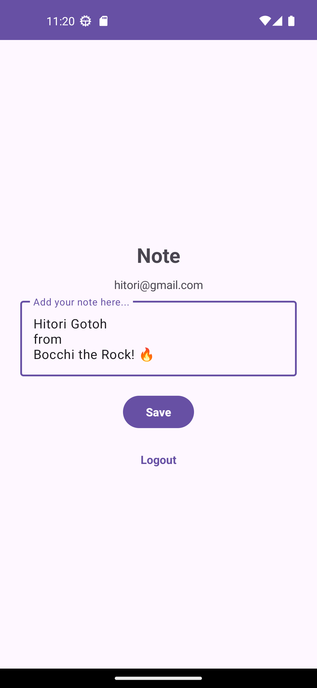

# Android Note

A simple note-taking app for Android using Firebase.

## Firestore

Firestore rules:

```kotlin
rules_version = '2';

service cloud.firestore {
  match /databases/{database}/documents {    
    // Allow authenticated users to read and write to their own note
    match /notes/{noteId} {
      allow read, write: if request.auth != null && request.auth.uid == noteId;
    }
  }
}
```

## Screenshots

<p float="left">
    
    
</p>
